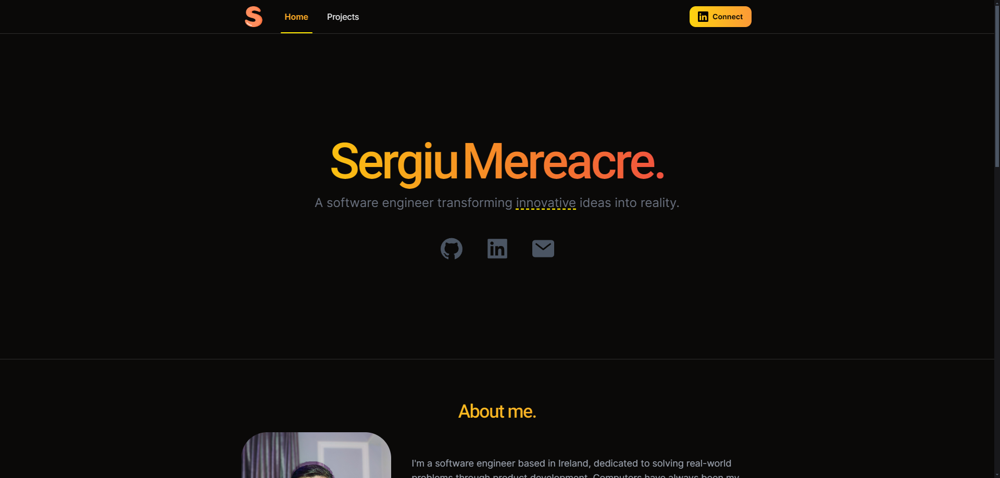

# Next.js Portfolio Website



## Introduction

Welcome to my portfolio website! This project is built using TypeScript, Next.js and Framer Motion, showcasing my skills, projects, and experience. Feel free to explore the code, contribute, or use it as inspiration for your own projects.

## Features

- Built with TypeScript and Next.js
- Showcases projects and skills
- Easy to navigate and user-friendly
- Responsive design

## Installation

Follow these steps to get a local copy up and running:

### 1. Clone the repository

```bash
git clone https://github.com/sergiumereacre/portfolio-website.git
cd portfolio-website
```

### 2. Install dependencies

```bash
npm install
```

### 3. Start the development server

```bash
npm run dev
```

## Contact

If you have any feedback, please reach out to me at:

- Email: <contact@sergiu.ie>

- LinkedIn: [Sergiu Mereacre](https://www.linkedin.com/in/sergiumereacre/)

- Website: [sergiu.ie](https://sergiu.ie)
